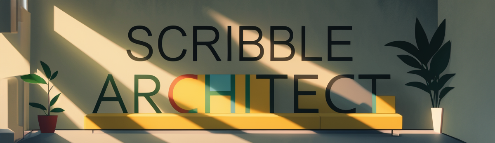
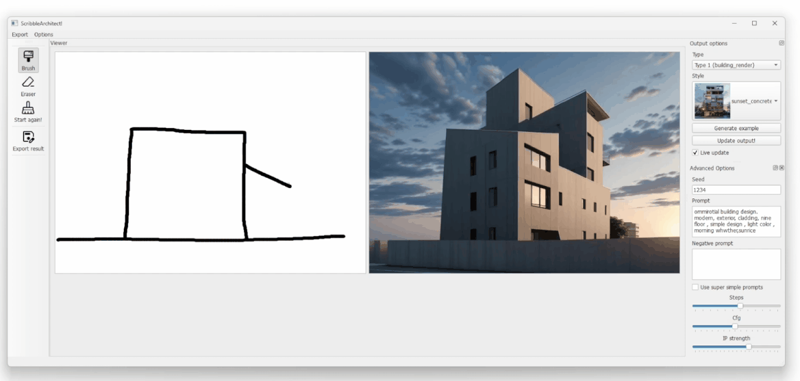
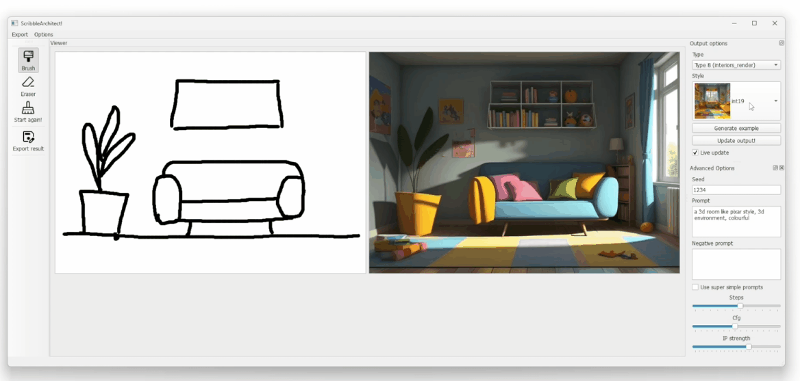
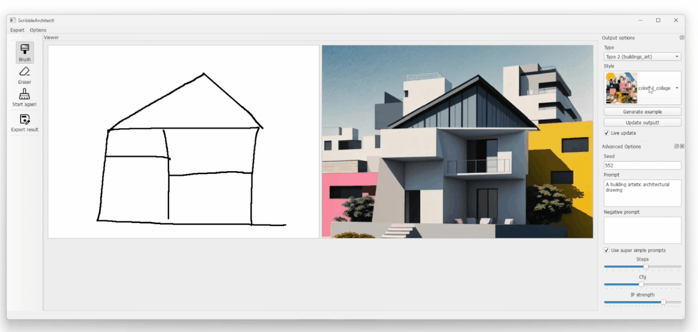
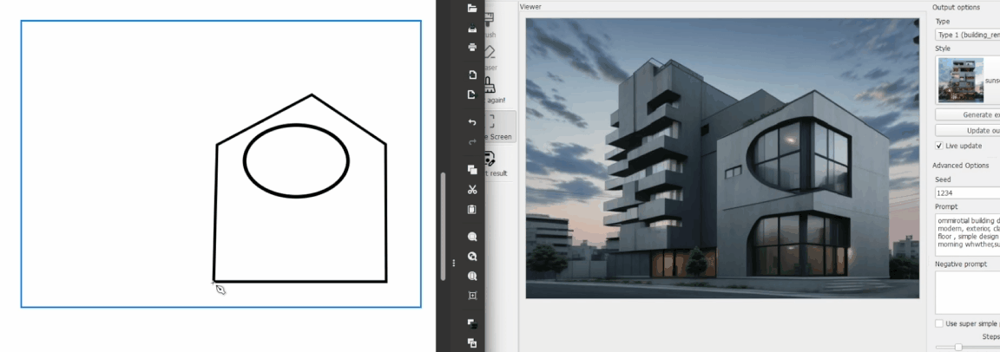
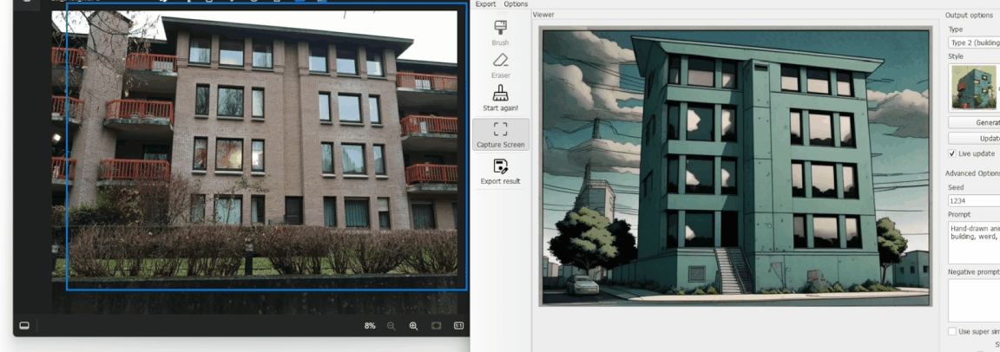

Image generation from simple brush strokes, in realtime. The functions have been designed primarily for use in architecture, and for sketching in the early stages of a project. It uses Stable Diffusion and ControlNet as AI backbone for the generative process. IP Adapter support is included, as well as a large library of predefined styles! Each reference image allows to transfer a specific style to your black and white line work.

<div style="text-align: center;">
    
    <p>
    <i style="display: block; margin-top: 5px;">example showing live drawing</i>
    </p>
</div>

<div style="text-align: center;">
    
    <p>
    <i style="display: block; margin-top: 5px;">example showing the change of style (interior)</i>
    </p>
</div>

<div style="text-align: center;">
    
    <p>
    <i style="display: block; margin-top: 5px;">example showing the change of style (exterior) </i>
    </p>
</div>

## Installation
- Install CUDA (if not done already)
- Clone the repo and install a venv.
- Install torch. Example for CUDA 11.8:
```
pip3 install torch torchvision torchaudio --index-url https://download.pytorch.org/whl/cu118
```
 (see https://pytorch.org/get-started/locally/)
- Install other dependencies (see requirements):
      - accelerate
      - diffusers
      - transformers
      - PyQT6
      - opencv-python
      - peft
- Launch main.py (the first launch can be long due to the models installation process!)

## Usage
Choose a 'type' of architectural design (exterior render, facade elevation, interior render, ...) and a style. On the left zone, paint with a brush and see the proposed image adapting live. If you lack inspiration, or for testing purpose, a example line drawing can be generated automatically.
Mouse wheel to adapt cursor size. 

We added a screen capture function. it creates a capture box (blue border) that can be dragged around. Once happy with the capture, click again on the tool to desactivate it. It allows to work with powerful tools as input (Adobe Illustrator, Inkscape, ...).

<div style="text-align: center;">
    
    <p>
    <i style="display: block; margin-top: 5px;">Screen Capture function with Inkscape as input </i>
    </p>
</div>

Of course, the screen capture can be used to grab images!

<div style="text-align: center;">
    
    <p>
    <i style="display: block; margin-top: 5px;">Screen Capture function with an image as input </i>
    </p>
</div>

## Options
The SD model can be adapted in the lcm.py file. Live drawing requires a strong GPU, I would advice to reduce image size (in main.py) if too laggy!

# Included models
By default, the app uses Dreamshaper (https://huggingface.co/Lykon/dreamshaper-8)


