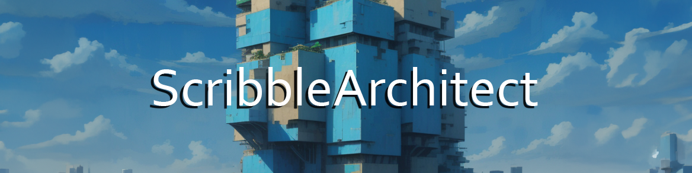
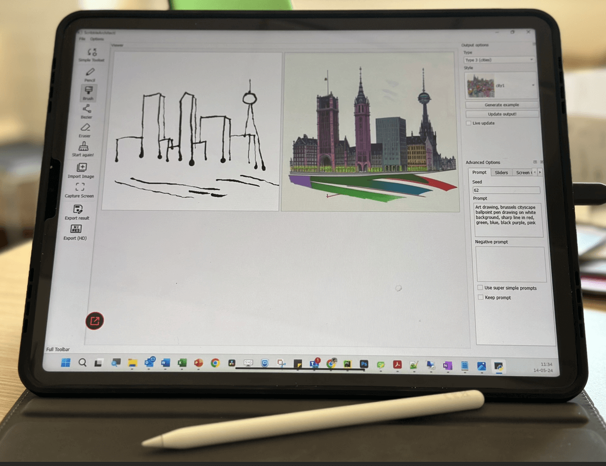
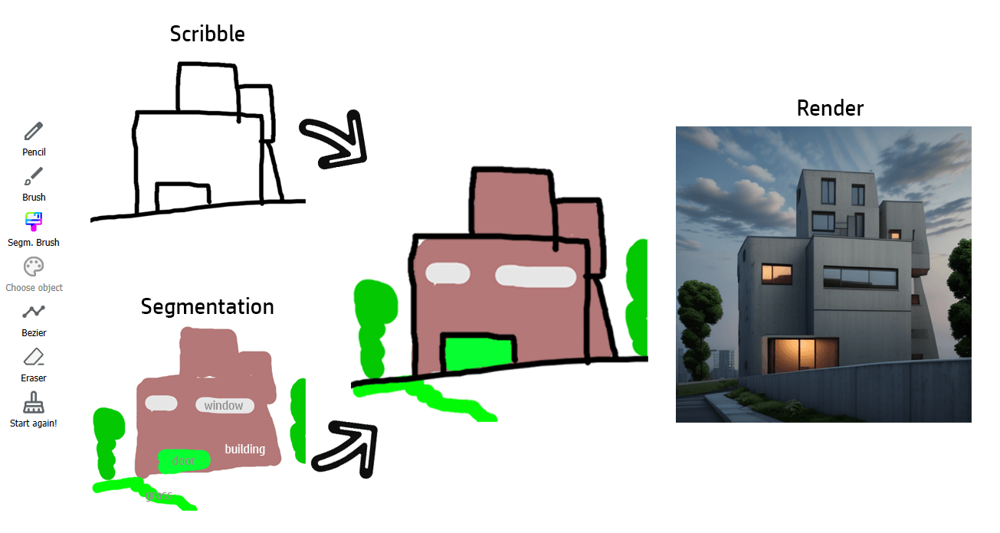
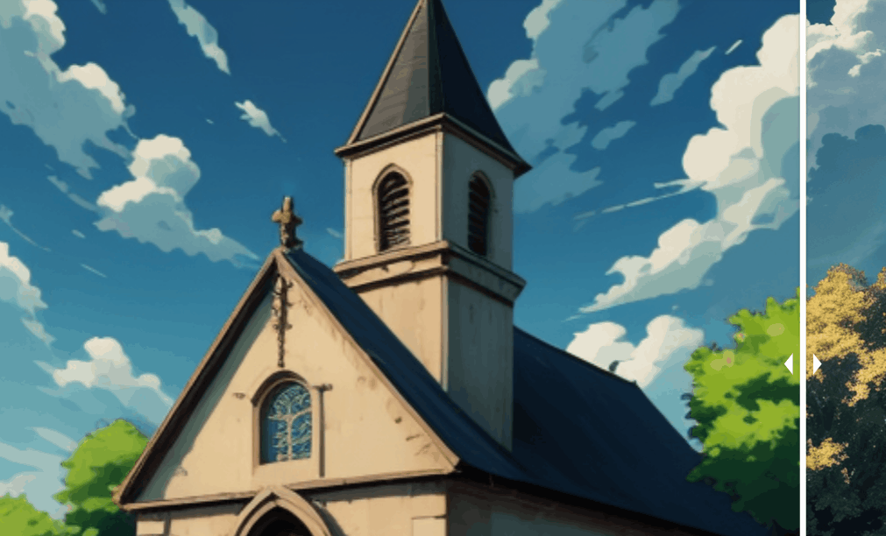
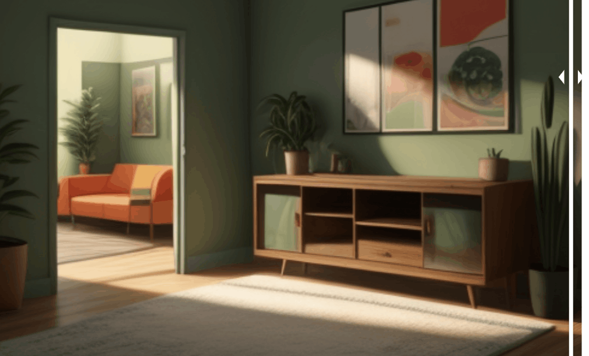

>**Line drawing, segmentation, style transfer and upscale with Stable Diffusion!**

This GUI allows generating images from simple brush strokes, or Bezier curves, in realtime. The functions have been designed primarily for use in architecture, and for sketching in the early stages of a project. It uses Stable Diffusion and ControlNet as AI backbone for the generative process. IP Adapter support is included, as well as a large library of predefined styles! Each reference image allows to transfer a specific style to your line work. An upscale function was also added, to export results in high resolution (based on ControlNet tile).


<p align="center">
    
    <p align="center">
    <i style="display: block; margin-top: 5px;">example showing live drawing</i>
    </p>
</p>

<p align="center">
    
    <p align="center">
    <i style="display: block; margin-top: 5px;">example showing the change of style (interior)</i>
    </p>
</p>

<p align="center">
    
    <p align="center">
    <i style="display: block; margin-top: 5px;">example showing the change of style (exterior) </i>
    </p>
</p>

# News!
Many new functions were recently added:
- Generate random scribbles
- Draw segmentation zone for specific objects (sky, building, windows, ...)
- Tablet drawing support (touch screen, Ipad, ...)
- Custom style import
- Draw over background model
- Import image for different purposes
   - As a support for drawing
   - As scribble
   - As segmentation zone
- ...


we have recently incorporated a new layer system, when the user can draw either black lines (for feeding ControlNet Scribble) or color brush strokes (for ControlNet Segmentation). See 'Using the app'
You can still find the old version in the 'releases' section.

<p align="center">
    
</p>

# Using the app
<p align="center">
    
</p>

Choose an architectural design 'type' (exterior rendering, façade elevation, interior rendering, ...) and a style. On the left, you'll find the drawing area. You can add either black lines to define the important lines of your drawing, or colored zones (a semantic map) to define where specific objects should be placed (a tree, a window, etc.). A specific color code is associated with each type of object. You don't have to worry about choosing the right color, as the graphical interface allows you to directly select the object to be drawn. 
The drawing process itself is completely standard. Choose your tool and draw! (or delete). You'll see the proposed image adapt live (a checkbox allows you to disable live inference). 

If you lack inspiration, or for testing purpose, a example scribble drawing can be generated automatically.

Images can also be imported to automatically generate scribbles and/or segmentation.

We also added a screen capture function. it creates a capture box (blue border) that can be dragged around and will generate scribbles based on the captured zone. Once happy with the capture, click again on the tool to desactivate it. It allows to work with powerful tools as input (Adobe Illustrator, Inkscape, ...).

<p align="center">
    
    <p align="center">
    <i style="display: block; margin-top: 5px;">Screen Capture function with Inkscape as input </i>
    </p>
</p>

## Upscaling
The render can be exported in high resolution, thanks to a ControlNet upscaler. More options will be integrated soon!
<p align="center">
    
    <p align="center">
    <i style="display: block; margin-top: 5px;">Upscaling (artistic exterior render) </i>
    </p>
</p>

<p align="center">
    
    <p align="center">
    <i style="display: block; margin-top: 5px;">Upscaling (realistic interior render) </i>
    </p>
</p>

## Tablet support
Support for drawing media has recently be included. The pressure of the pen should be detected. Tested on Ipad Pro + EasyCanvas.

https://github.com/s-du/ScribbleArchitect/assets/53427781/d827b763-f7b4-4e1d-b0e7-1f628a62b924

## Options
Live drawing requires a strong GPU, I would advice to reduce image size (in main.py) if too laggy! Image upscale is really GPU intensive...

## Included inference models
By default, the app uses Dreamshaper (https://huggingface.co/Lykon/dreamshaper-8). Custom models can be added in the dedicated folder ('custom_models'). Any SD1.5 checkpoint should work. 

# Installation
- Install CUDA (if not done already)
- Clone the repo and install a venv.
- Install torch. Example for CUDA 11.8:
```
pip3 install torch torchvision torchaudio --index-url https://download.pytorch.org/whl/cu118
```
 (see https://pytorch.org/get-started/locally/)
- Install other dependencies (see requirements):
    - accelerate
    - diffusers
    - transformers
    - PyQT6
    - opencv-python
    - opencv-contrib-python
    - peft
- Launch main.py (the first launch can be long due to the models installation process!)

# Useful references
https://huggingface.co/lllyasviel/sd-controlnet-seg
https://huggingface.co/lllyasviel/sd-controlnet-scribble
  

